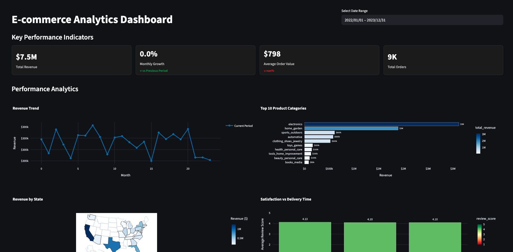

# E-commerce Business Analytics Dashboard



## Overview

This repository contains a comprehensive e-commerce analytics solution with both Jupyter notebook analysis and a professional Streamlit dashboard. The solution transforms raw business data into actionable insights, focusing on revenue performance, product analytics, geographic distribution, and customer experience metrics.

## Repository Structure

```
notebook-to-dashboard/
├── EDA_Refactored.ipynb      # Main analysis notebook with comprehensive documentation
├── streamlit_dashboard.py    # Professional Streamlit dashboard application
├── data_loader.py            # Data loading and preprocessing module
├── business_metrics.py       # Business metrics calculation functions
├── requirements.txt          # Python dependencies including Streamlit
├── README.md                # This documentation file
└── ecommerce_data/          # Data directory
    ├── orders_dataset.csv
    ├── order_items_dataset.csv
    ├── products_dataset.csv
    ├── customers_dataset.csv
    └── order_reviews_dataset.csv
```

## Key Features

### 📊 Streamlit Dashboard
- **Professional Layout**: Clean header with date range filter, KPI cards, charts grid, and bottom metrics
- **Interactive Visualizations**: Plotly-powered charts with hover details and zoom capabilities
- **Real-time Filtering**: Global date range selection that updates all charts simultaneously
- **Trend Indicators**: Color-coded arrows showing positive/negative trends with precise percentages
- **Dark Theme Support**: Enhanced contrast and readability for both light and dark themes
- **Responsive Design**: Uniform card heights and professional business styling
- **Error Handling**: Robust zero-division protection and data validation

### 📈 Dashboard Components
- **KPI Row**: Total Revenue, Monthly Growth, Average Order Value, Total Orders (all with trend indicators)
- **Revenue Trend Chart**: Line chart with current period (solid) vs previous period (dashed) comparison
- **Top 10 Categories**: Horizontal bar chart with blue gradient showing revenue by product category
- **US Choropleth Map**: Geographic revenue distribution across states with blue color intensity
- **Delivery Satisfaction**: Bar chart showing average review scores by delivery time buckets
- **Bottom Cards**: Average delivery time and review score with star ratings

### 🎯 Configurable Analysis Framework
- **Time Period Configuration**: Easily analyze any date range or specific months/years
- **Comparison Analysis**: Built-in period-over-period growth calculations
- **Flexible Filtering**: Configurable analysis scope based on business needs

### 📊 Comprehensive Business Metrics
- **Revenue Analysis**: Total revenue, growth rates, average order value
- **Product Performance**: Category analysis, market share, pricing insights
- **Geographic Analysis**: State-level performance, customer distribution
- **Customer Experience**: Satisfaction scores, delivery performance, NPS estimation
- **Business Health**: Overall health score combining multiple KPIs

### 🎨 Enhanced Visualizations
- **Professional Styling**: Business-friendly color schemes and formatting
- **Interactive Charts**: Plotly-based interactive dashboards
- **Clear Documentation**: Proper titles, axis labels, and legends
- **Multi-panel Dashboards**: Comprehensive views of business performance

### 🔧 Code Quality Improvements
- **Modular Architecture**: Separated data loading and business logic
- **Reusable Functions**: Well-documented functions with clear interfaces
- **Error Handling**: Robust data quality checks and warnings
- **Type Hints**: Improved code clarity and IDE support

## Quick Start

### Prerequisites

Ensure you have Python 3.8+ installed with the following packages:

```bash
pip install -r requirements.txt
```

### Running the Streamlit Dashboard

1. **Start the dashboard**:
```bash
streamlit run streamlit_dashboard.py
```

2. **Access the dashboard**: Open your browser to `http://localhost:8501`

3. **Use the date filter**: Select your desired date range in the top right corner (defaults to 2022-2023)

4. **Explore the data**: All charts and KPIs update automatically based on your date selection

5. **Theme support**: Dashboard automatically adapts to your browser's light/dark theme preference

### Running the Jupyter Notebook Analysis

1. **Configure Analysis Parameters**: Open `EDA_Refactored.ipynb` and modify the configuration section:

```python
# ANALYSIS CONFIGURATION
ANALYSIS_YEAR = 2023          # Primary analysis year
ANALYSIS_MONTH = None         # Specific month (1-12) or None for full year
COMPARISON_YEAR = 2022        # Comparison period year
COMPARISON_MONTH = None       # Comparison month or None

# Alternative: Use specific date ranges
USE_DATE_RANGE = False
START_DATE = '2023-01-01'
END_DATE = '2023-12-31'
```

2. **Run the Notebook**: Execute all cells to generate the complete analysis dashboard

3. **Review Results**: The notebook generates comprehensive visualizations and insights

### Using the Modules Independently

#### Data Loading

```python
from data_loader import create_analysis_dataset, get_data_summary

# Load data for specific time period
data = create_analysis_dataset(
    data_path='ecommerce_data/',
    year=2023,
    month=None  # Full year
)

# Get data summary
get_data_summary(data)
```

#### Business Metrics

```python
from business_metrics import (
    calculate_revenue_metrics, 
    analyze_product_performance,
    analyze_customer_experience
)

# Calculate revenue metrics
revenue_metrics = calculate_revenue_metrics(data)

# Analyze product performance
product_analysis = analyze_product_performance(data, top_n=10)

# Customer experience analysis
cx_metrics = analyze_customer_experience(data)
```

## Data Dictionary

### Core Datasets

| Dataset | Description | Key Columns |
|---------|-------------|-------------|
| **orders_dataset.csv** | Order lifecycle information | order_id, customer_id, order_status, timestamps |
| **order_items_dataset.csv** | Product and pricing details | order_id, product_id, price, freight_value |
| **products_dataset.csv** | Product catalog information | product_id, product_category_name |
| **customers_dataset.csv** | Customer geographic data | customer_id, customer_state, customer_city |
| **order_reviews_dataset.csv** | Customer feedback data | order_id, review_score |

### Key Business Metrics

| Metric | Calculation | Business Significance |
|--------|-------------|----------------------|
| **Total Revenue** | Sum of (price + freight_value) for delivered orders | Primary business performance indicator |
| **Average Order Value** | Total revenue ÷ Number of unique orders | Customer spending behavior measure |
| **Revenue Growth Rate** | (Current - Previous) ÷ Previous × 100% | Business growth trajectory |
| **Customer Satisfaction** | Average review_score on 1-5 scale | Service quality indicator |
| **Delivery Performance** | Average days from purchase to delivery | Operational efficiency measure |

## Analysis Sections

### 1. Configuration & Setup
- Environment configuration and parameter setting
- Library imports and styling setup
- Analysis scope definition

### 2. Data Loading & Preparation
- Automated data loading with quality checks
- Data enrichment and transformation
- Missing data handling and validation

### 3. Revenue Analysis
- Period-over-period revenue comparison
- Monthly trend analysis and seasonality
- Average order value trends
- Growth rate calculations

### 4. Product Performance Analysis
- Category-wise revenue analysis
- Market share distribution
- Pricing analysis by category
- Cross-category performance comparison

### 5. Geographic Analysis
- State-level performance metrics
- Customer concentration analysis
- Revenue per customer by region
- Interactive geographic visualizations

### 6. Customer Experience Analysis
- Review score distribution and trends
- Delivery performance analysis
- Net Promoter Score estimation
- Service quality correlation analysis

### 7. Business Health Dashboard
- Overall business health scoring
- Component metric analysis
- Executive summary generation
- KPI tracking and monitoring

## Customization Options

### Time Period Analysis

```python
# Analyze specific month
ANALYSIS_YEAR = 2023
ANALYSIS_MONTH = 6  # June 2023

# Analyze date range
USE_DATE_RANGE = True
START_DATE = '2023-06-01'
END_DATE = '2023-08-31'  # Q2-Q3 2023
```

### Visualization Customization

```python
# Modify business colors
BUSINESS_COLORS = {
    'primary': '#2E86AB',
    'secondary': '#A23B72', 
    'success': '#27AE60',
    'warning': '#F39C12',
    'danger': '#E74C3C'
}

# Adjust analysis scope
TOP_N_CATEGORIES = 15  # Show top 15 categories
TOP_N_STATES = 20      # Show top 20 states
```

### Metric Configuration

```python
# Add custom metrics in business_metrics.py
def calculate_custom_metrics(df):
    # Your custom business logic
    return custom_results
```

## Best Practices

### Data Quality
- Always run data quality checks before analysis
- Handle missing values appropriately for your business context
- Validate date ranges and filter logic

### Performance Optimization
- Use vectorized pandas operations
- Leverage caching for repeated calculations
- Consider data sampling for very large datasets

### Business Context
- Align metrics with business objectives
- Include domain expertise in metric interpretation
- Regular validation with business stakeholders

## Advanced Usage

### Extending the Analysis

1. **Add New Data Sources**: Modify `data_loader.py` to include additional datasets
2. **Custom Metrics**: Extend `business_metrics.py` with domain-specific calculations
3. **Additional Visualizations**: Add new chart types in the notebook
4. **Automated Reporting**: Schedule notebook execution for regular reports

### Integration Options

- **Data Pipelines**: Connect to data warehouses or APIs
- **Dashboard Tools**: Export results to BI platforms
- **Alert Systems**: Set up threshold-based monitoring
- **Machine Learning**: Add predictive analytics components

## Troubleshooting

### Common Issues

1. **Import Errors**: Ensure all dependencies are installed via `requirements.txt`
2. **Date Parsing Issues**: Check date format consistency in source data
3. **Memory Issues**: Consider data sampling for large datasets
4. **Visualization Display**: Ensure Jupyter notebook widgets are enabled

### Performance Optimization

- Use `pd.read_csv()` with `dtype` specification for large files
- Implement data caching for repeated analysis
- Consider using `dask` for very large datasets

## Contributing

When extending this analysis framework:

1. Follow existing code style and documentation patterns
2. Add comprehensive docstrings to new functions
3. Include data validation and error handling
4. Update this README with new features
5. Test with different time periods and data ranges

## License

This analysis framework is provided as-is for educational and business analytics purposes.

## Support

For questions or issues:
1. Check the troubleshooting section above
2. Review the notebook documentation and comments
3. Examine the module docstrings for detailed function information

---

*This refactored analysis provides a solid foundation for e-commerce business intelligence with professional-grade visualizations, modular code architecture, and configurable analysis parameters.*